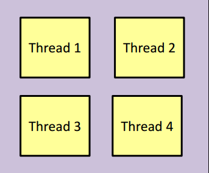
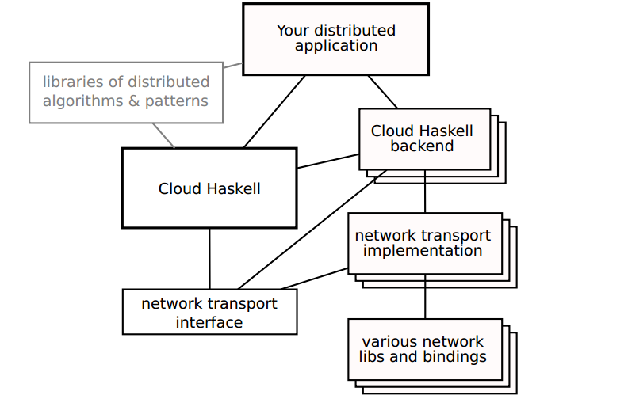

% Haskell in the Cloud
% Pankaj More 
% Nov 16, 2012

# Concurrency
 

* Concurrency across multiple machines

# Why? 

* More parallelism
    * lots of machines = lots more processing power
    * think Amazon EC2, Google AppEngine, Microsoft Azure
    * or just a few machines on your local network
    * or just a few machines on your local network
        * separate processes have separate heaps and can do independent 
GC
        * trade communication cost for better locality and maybe better 
scaling

* Spread your data around
    * a lot of machines can keep a large database in memory

# Distributed Programming
* Is it just like concurrent programming?
    * No: distribution is different.
* Is that like client / server?
* Key Idea : Program the cluster as a whole, not individual nodes

# Different Use Cases
* Traditional local approach
    * client / server
    * loose coupling
    * programs and nodes can be written and operated by
different organisations
    * requires well-defined protocols
* Global approach
    * “I have 50–5000 machines I want to run this program on”
    * requires control over all nodes
    * internal protocol doesn’t matter

# Local vs global perspective
* Traditional approach gives you a local node perspective
    * you’re in a box, reacting to messages from your peers
    *  encourages a homogeneous style, all nodes do the same
(or write different programs for different tasks, e.g.
master/worker)
* Erlang and Cloud Haskell give you a global perspective
    * you can see all nodes,
    * run one program with easy access to them all
    * you fire off lots of processes, placing them on nodes
    * doesn’t need to be homogeneous, it’s easy to have
different processes on different nodes

# The Basic Idea
* All communication is done with message 
passing
* (just like Erlang)
* Primitive operations:
    * fork a process
    * send a message to another process
    * send a message to another process
    * (there are also channels)

# Cloud Haskell
* What’s it all about?
    * Slogan could be “Erlang for Haskell” (as a library)
    * Concurrent distributed programming in Haskell
    * A programming model + an implementation

# Cloud Haskell

* What’s the point?
    * To let you program a cluster as a whole
    * or a data centre,
    * or a bunch of VMs rented from Azure / Amazon /

* Key Idea
    * Program the cluster as a whole, not individual nodes

# Papers
* Jeff Epstein, Andrew Black and Simon Peyton Jones,
Towards Haskell in the Cloud, Haskell Symposium 2011
* Jeff Epstein, Functional programming for the data centre,
MPhil thesis, 2011

# Programming Model
* Explicit concurrency
* Lightweight processes
* No state shared between processes
* Asynchronous message passing
* Some people call this the “actor model”

# Cloud Haskell Design
* Basic approach
    * Design is implementable as a library
    * minimal language and RTS changes
 
* If in doubt, do it the way Erlang does it

# The Core API
~~~ {.haskell}
instance Monad Process
instance MonadIO Process
data ProcessId
data NodeId
class (Typeable a, Binary a) ⇒ Serializable a
send :: Serializable a ⇒ ProcessId → a → Process ()
expect :: Serializable a ⇒ Process a
spawn :: NodeId → Closure (Process ()) → Process ProcessId
getSelfPid :: Process ProcessId
getSelfNode :: Process NodeId
~~~

# Error Handling Style
* Errors are everywhere in distributed programming

* Cloud Haskell steals Erlang’s solution
    * Let processes fail
    * communication loss counts as failure
    * Notify interested processes
    * often they just fail too (linked processes)
    * common pattern is to monitor and restart

# Why CloudHaskell
* Highly Modular: Implemented as a Library
* Shared Memory Concurrency within a process
* Multiple Typed Channels
* A better handling of node disconnect and reconnect

# No RTS surgery please!
* What’s the problem with adding it directly into the RTS?
    * it’s a lot of work!
    * ongoing maintenance burden
    * yet more complexity
    * RTS is monolithic
    * everyone has to trust the RTS

# Advantages of the library approach
* much greater flexibility
* easier to experiment
* can use different implementations in different environments

* Library author has control over
    * serialisation approach
    * network data transport layer
    * network configuration and performance parameters
    * communication network topology
    * peer node discovery or creation

# Example Use Cases
* Distributed parallelism covers diverse use cases
    * traditional clusters
        * ( ethernet + IP (TCP or UDP)
        * local peer discovery
        * or config via cluster job scheduler
    * HPC clusters
        * infiniband and other exotic non-IP networks
        * latency is critical
    * supercomputer-scale parallelism
        * ‘interesting’ scaling issues with 10k+ nodes
    * VMs in the cloud
        * nodes can be created on demand
    * large multi-core servers
        * shared memory or pipes

# Erlang Anecdote
* HPC expert looked into using Erlang for HPC clusters
(think 1000’s of nodes, infiniband networking)
* Conclusion:
    * not suitable for HPC
    * interpreter too slow
    * networking layer too inflexible
        * UDP/IP networking built into the RTS
        * minimal control over network tuning parameters
        * implementation not designed to scale to 1000’s of nodes

# Exploiting the Library Advantage
* Exploit the advantages of the library approach to better handle
the diverse range of use cases
* Axes of variation between use cases
    * network data transport layer (hardware and protocol)
        * IP
        * exotic non-IP HPC networks (infiniband and faster)
        * shared memory or local pipes
    * network tuning parameters
        * totally different between IP, HPC, shared memory
        * makes a big performance difference (especially for HPC)
        * ideal tuning depends on application and network
environment
    * How to start your executable on each machine
        * remote login via ssh
        * cloud service API
        * cluster job scheduler

# Yet more use cases
    * How to configure each node
        * via ssh from master node
        * config files, env vars, string and glue
        * config distributed via cluster job scheduler
    * How to find initial peers or all peers
        * discover dynamically on LAN
        * known from config
        * cluster job scheduler
        * peers created in new VMs
        * in large clusters, each node may only know a few peers

# Modular Internal Design

# Typed Channels
* Ensure that shared memory constructs cannot be send as messages
* MVars and Tvars are not serializable

~~~ {.haskell}
data SendPort a     -- instance of Typeable, Binary
data ReceivePort a
newChannel       :: Serializable a
                 => ProcessM (SendPort a, ReceivePort a)
sendChannel      :: Serializable a
                 => SendPort a -> a -> ProcessM ()
receiveChannel   :: Serializable a
                 => ReceivePort a -> ProcessM a
~~~

* SendPort is serialisable, but ReceivePort
is not!
* the destination for a message cannot change or be 
duplicated, because we would have to tell all the 
senders

# Node disconnect and reconnect
* Current Erlang behaviour
    * buffers messages temporarily
    * then drops messages
    * sacrifices reliability property
* “Unified semantics for future Erlang”
    * drops messages to dead nodes
    * buffers messages to disconnected nodes
    * keeps reliability property
    * impossible to implement

# Node disconnect and reconnect
* Semantics for Cloud Haskell
    * drop messages permanently (by default)
    * this keeps the reliability property (!!)
    * explicit reconnect primitive
    * reconnect to accept intermediate message loss
* A reasonable compromise
    * simple reliability guarantee
    * most code does not need to handle reconnect
    * it simply fails on the initial disconnect
    * code that wants to handle reconnect explicitly opts in and
    *  accepts the reality of message loss

# About Apache Pig 
* Map-reduce is a low-level programming envinroment
* In most applications need more complex queries 
* Pig-latin accepts higher level queries, translates them to sequences of map-reduce

# Example
* Input: a table of urls:  
(url, category, pagerank) 
* Compute the average pagerank of all 
sufficiently high pageranks, for each 
category 
* Return the answers only for categories with 
sufficiently many such pages 

# Code
~~~ {.haskell}
good_urls = FILTER urls BY pagerank > 0.2 
groups = GROUP good_urls BY category 
big_groups = FILTER groups  
     BY COUNT(good_urls) > 10^6
output = FOREACH big_groups GENERATE 
   category, AVG(good_urls.pagerank)
~~~

# Advantage
* A standard PigLatin script is 20x shorter than its equivalent in Java MapReduce
* takes a programmer 16x less time to implement it
* at the same time being only slightly slower than Java MapReduce

# Impact
* Apache Pig is now frequently used by many well-recognized companies and organizations e.g. Yahoo! (currently about 90% Hadoop jobs is written in PigLatin), Twitter, Nokia Ovi Maps, AOL, Mendeley, LinkedIn and ICM UW.

# Proposal
* A pig-like DSL on top of CloudHaskell
* Haskell is quite well-suited for implementing DSLs

# Use Abstract Data Types
* Example

~~~ {.haskell}
data Expr =    I Int            -- integer constants
             | Add Expr Expr    -- add two expressions
             | Mul Expr Expr    -- multiply two expressions

eval :: Expr -> Int
   eval (I n)       = n
   eval (Add e1 e2) = eval e1 + eval e2
   eval (Mul e1 e2) = eval e1 * eval e2
~~~

# PigLatin as a DSL in Haskell

~~~ {.haskell}
  data Stmt =  Load Relation
             | Filter Relation
             | Group Relation By Category

  data Relation 
  and so on ...               
~~~

* Given a Map-Reduce Framwork(in progress) on top of Cloud Haskell,
convert Pg-Latin statements as composition of Map Reduce functions

# Future Work
* Improve the semantics of Pig-Latin to leverage CloudHaskell specific features.
* Make a protype implementation of pig-like DSL on top of CloudHaskell
* Benchmark the implementation against PigLatin on Hadoop

# Questions

